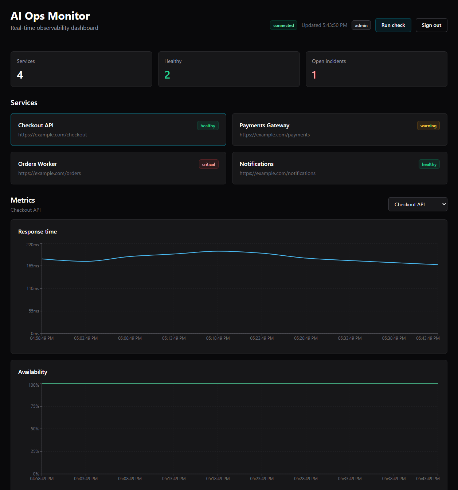

# AI Ops Monitor

AI Ops Monitor is a production-style observability dashboard for tracking
service health, response time, availability, logs, incidents, alert
thresholds, and AI-assisted incident summaries.

The project is built as a portfolio-grade full-stack system:

- FastAPI backend with async SQLAlchemy
- PostgreSQL persistence with Alembic migrations
- Redis/Celery support for background work
- Gemini-powered incident insights
- Next.js dashboard with JWT admin auth
- WebSocket updates for live service/log/incident events
- Docker Compose local production simulation

## Screenshot

Add a dashboard screenshot here after running the local Docker stack.



Recommended screenshot: the authenticated dashboard after adding one or
two services and running a monitoring check, with metric charts, service
cards, live logs, and the incidents area visible.

## Architecture

```text
Browser
  -> Next.js dashboard
  -> FastAPI API
  -> PostgreSQL
  -> Redis / Celery
  -> Gemini API
```

Local Docker stack:

```text
frontend -> backend -> postgres
                  -> redis
worker/beat -> backend code -> postgres/redis
```

For the full architecture notes, see:

- `docs/architecture.md`
- `docs/environment-hardening.md`
- `docs/free-deployment.md`

## Features

- Admin login with signed JWT authentication
- Protected dashboard, API routes, and WebSocket stream
- Service registry with health status
- Manual monitoring checks from the dashboard
- Response-time and availability metrics
- Configurable warning/critical latency thresholds
- Incident lifecycle actions: resolve, reopen, escalate
- AI insight generation for incidents
- Live logs and realtime dashboard updates
- Dockerized local production-like stack

## Tech Stack

Backend:

- FastAPI
- SQLAlchemy async
- Alembic
- PostgreSQL
- Redis
- Celery
- Google Gemini API

Frontend:

- Next.js
- React
- TypeScript
- Tailwind CSS
- Recharts

Infrastructure:

- Docker
- Docker Compose
- Render-compatible backend deployment docs
- Vercel-compatible frontend deployment docs

## Local Docker Run

From the project root:

```powershell
Copy-Item .env.docker.example .env
docker compose up --build
```

Open:

```text
http://localhost:3000
```

Default local login:

```text
username: admin
password: admin
```

Backend health check:

```text
http://localhost:8000/health/
```

## Useful Local Commands

Frontend:

```powershell
cd frontend
npm.cmd run lint
npm.cmd run build
```

Docker:

```powershell
docker compose ps
docker compose logs backend worker beat --tail=100
docker compose down
```

## Environment Files

Committed templates:

- `.env.docker.example`
- `.env.production.example`
- `backend/.env.example`
- `frontend/.env.example`

Ignored local files:

- `.env`
- `backend/.env`
- `frontend/.env`

Never commit real production secrets.

## Free Deployment Path

The free deployment path uses:

- Render free web service for the backend API only
- Vercel free project for the frontend
- Neon for Postgres
- Upstash for Redis, optional

The free path does not run always-on Celery worker/beat services in the
cloud. Manual dashboard checks still work.

See `docs/free-deployment.md`.

## Production Notes

Production requires:

- strong `SECRET_KEY`
- strong `ADMIN_PASSWORD`
- production `DATABASE_URL`
- production `CORS_ORIGINS`
- frontend `NEXT_PUBLIC_API_URL`
- frontend `NEXT_PUBLIC_WS_URL`

See `docs/environment-hardening.md`.
